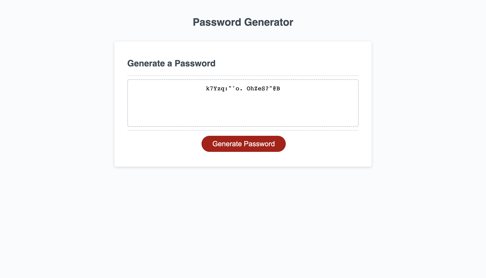

# Challenge-03

## Description

This was the third challenge of the bootcamp, having students construct a password generator from starter code. While partaking in this challenge one can get very familiar with basic javascript. The logic puzzles used to create the project is useful and seeing how to refactor the code to make it simpler is fun as well.

## Usage

This can be used to generate passwords for future use.

## Link to Pages

[Challenge-03](https://ptookey.github.io/Challenge-03/)

## Screenshot of Page

